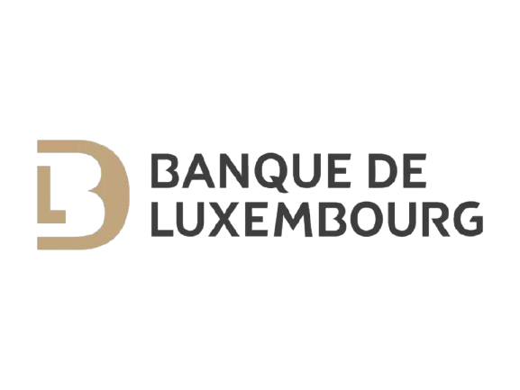

# Machine Learning Engineer

⚙️ Technical Skills: **Python, SQL, Airflow, Docker, Kubernetes, Kedro, Linux (bash), Git, GitHub Actions (CI/CD)**

📧 armand.masseau@gmail.com 
🔗 [LinkedIn](https://www.linkedin.com/in/armand-masseau)  

---

## Projects

### [📌 Job Finder — Smart Job Recommendation System](https://github.com/armandmasseaugit/job_finder)

**Turned job hunting into a personalized daily briefing**  
Developed an end-to-end system that automates job offer discovery across platforms and uses user feedback to train a machine learning model ranking jobs by relevance. The system combines data collection, model training, and deployment in a streamlined pipeline that delivers daily personalized recommendations via email and an interactive web app.  
> Stack: Python (Pandas, Kedro, pytest, requests), Scikit-learn, GitHub Actions, CI/CD, Streamlit, Airflow, Docker, Kubernetes, AWS S3.

---

## Work Experience

###  Machine Learning Engineer — *Société Générale*  
📍 Paris, Île-de-France — nov. 2025 – present  
Joined the Investment Banking DataLab (20 data scientists & engineers).
- Productionized machine learning models developed by Data Scientists, ensuring robustness, scalability, and monitoring in on-prem and Azure environments.
- Designed, deployed, and maintained **ML infrastructure** (training, inference, orchestration) with a strong focus on **reliability, observability, and cost optimization**.
- Implemented and standardized **CI/CD pipelines** for ML workflows, improving deployment consistency and reducing time-to-production.
- Supported Data Science teams on **best practices** in MLOps, infrastructure-as-code, and operational monitoring.

> Stack: Python, GitHub Actions (CI/CD), ArgoCD, Airflow, Docker, Kubernetes, Azure, Terraform, Elastic Stack, OpenTelemetry

---

###  Machine Learning Engineer — *Société Générale*  
📍 Paris, La Défense — 6 months (2025) \
Joined the Non-Financial Risk Datalab (7 data scientists). 
- Developed and deployed an LLM-based application that generates reports for the Risk Committee to track key risk indicators, **resulting in a collective time saving of six workdays per month for committee members**.
- Contributed to Société Générale’s internal data science library by adding reusable components and improving documentation.
> Stack: Python (Pandas, Langchain, FastAPI, Kedro, pytest), Airflow, Docker, Kubernetes, AWS S3, Trino, GitHub Actions, SonarQube, Jira, PostgreSQL

---

###  Data Engineer — *Banque de Luxembourg Investments*  
📍 Luxembourg, Luxembourg — 5 months (2024) \
Integration of a team of investment fund managers and analysts (10 people). I automated time-consuming processes for my tutor.
- Built a Python app to generate PDF reports with dynamic financial charts — **saving days of manual work monthly for my tutor and the CEO**.
- Automated file management and archiving for fund monitoring.
- **Reduced monthly data provider costs by several hundred euros** through smarter data queries.
- On my initiative, designed a cross-tab reporting tool for fund-of-funds analysis, now used by the team.
- Worked with Bloomberg and MSCI APIs to automatically fetch and enrich internal financial datasets.
> Stack: Python (Pandas, os, Matplotlib, Tkinter, shutil, ReportLab), Microsoft Office

---

## 📝 Technical Writing & Open Source

I regularly publish **in-depth technical articles and tutorials** on topics such as **Machine Learning engineering, MLOps, Airflow, Kedro, and production-grade data pipelines**.

🔗 **Medium**: [Armand Masseau on Medium](https://medium.com/@armand.masseau)

### 🧩 Open Source Contributions
Active contributor to major open-source projects in the data & ML ecosystem:

- **Cookiecutter** – Feature & improvements  
  https://github.com/cookiecutter/cookiecutter/pull/2163

- **Apache Airflow** – Core contribution  
  https://github.com/apache/airflow/pull/54259

- **Kedro** – Multiple contributions  
  https://github.com/kedro-org/kedro-plugins/pull/1216  
  https://github.com/kedro-org/kedro-plugins/pull/1207

---

## Education

**🎓 M.Sc. in Data Science (Quantitative Finance Track)**  
Université Paris-Saclay, France, 2024–2025  

**🎓 Engineering Degree — Microelectronics and Computer Science**  
Mines Saint-Étienne, France, 2022–2025  

**🎓 Preparatory Classes for Engineering Schools (PSI\*)**  
Toulouse, 2020–2022

---

## 💬 Recommendations

> *"I had the pleasure of supervising Armand during his internship, during which he demonstrated strong technical skills, exceeding our expectations.  
> He took full ownership of all the tasks assigned to him, working with great autonomy, rigor, and a strong sense of responsibility.  
> Armand also integrated perfectly into a team with diverse profiles, making a positive and constructive contribution.  
> I highly recommend his profile, as his professionalism and commitment would be a valuable asset to any organization."*  
> — **Paul Lemonnier**, Senior Data Scientist @ Société Générale

> *Last updated: Sept 2025*
